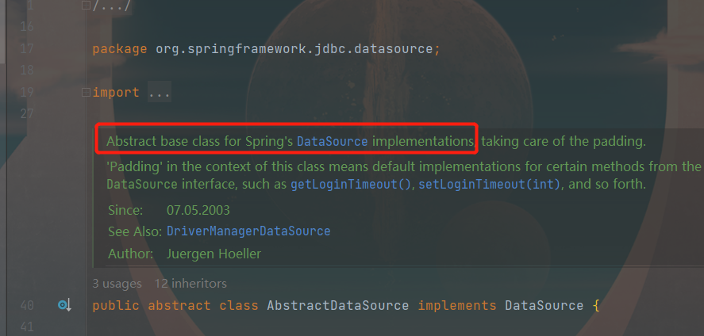

## spring-jdbc模块是为了契合DataSource多数据源的切换
- Spring中提供的基础类
    - 继承AbstractRoutingDataSource
    - 实现DataSource


```javascript
// 从上述图片分析：抽象类AbstractDataSource是Spring框架的DataSource类的默认实现
// 数据库操作方面集中于 spring-jdbc 依赖

```

### 切换数据源的两种方式
- mybatis 插件的形式（应用场景：读写分离）
  > mybatis Plugins
- AOP + 自定义注解 的方式 切换数据源